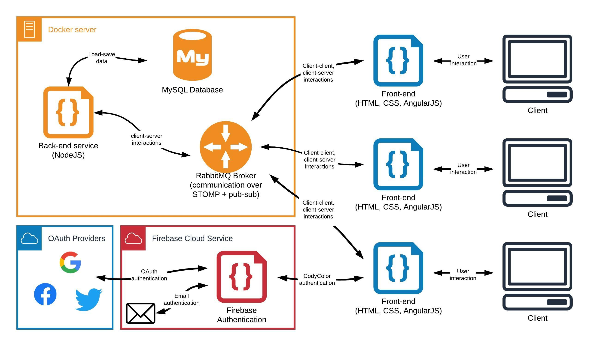

# CodyColor front-end service

[CodyColor Multiplayer](https://codycolor.codemooc.net/#!/) is an educational game developed by Digit S.r.l., inspired by the unplugged coding method **CodyColor**. Additional information about the game can be found in the [Digit blog](https://digit.srl/codycolor-multiplayer-learn-by-having-fun/). The software infrastructure on which the game is based is based on two main components:

* the **back-end**, composed by a [message broker and a NodeJS executable](https://github.com/digit-srl/CodyColorServer); all the back-end code is contained and handled in a Docker infrastructure;
* the **font-end**, composed by a web app developed on the AngularJS framework.



The front-end of the game is essentially a cross-platform, single-page web app, built following PWA specifications. This repository includes all the files that form the front-end system of the game.


## Source code organization

The code is organized in a Docker container, so as to make it easier to start up the front end. Once the container is installed in the Docker environment, it is sufficient to execute the command to set the PWA working:

```bash
make rebuild
```
The command activates the container, "mounting" the code contained inside the ```/build``` directory. Contents of the directory should not be modified directly. They are generated through a custom Grunt command when the app is ready to deploy. The deployment procedure is described in the homonym paragraph.

### The /src directory

The actual source of the PWA, abstracting from the configuration and docking, is contained in the ``src/contents`` directory. The website becomes dynamic thanks to the JavaScript code, all contained inside the ```/js``` folder. The code is completely modular, and built over the AngularJS framework.

Every section of the web app is handled by an AngularJS **controller** file. All controllers are positioned inside the ```/js/controllers``` folder. Ths various features expressed by the code are grouped using AngularJS **factories** in ```/js/factories```. In the practice of this app, every factory actually represents a different **code module**. Every module is then used by different controllers and by other modules.

This source code was created based on [HTML5 Boilerplate](https://html5boilerplate.com/). A description of the boilerplate components can be found on their website.

The external libraries used by PWA are managed through the package manager **Bower**.

Also, you should not manually add ```<script>``` and ```<link>``` tag inside ```index.html``` file, beacuse the insertion is automatically handled during the deployment process.


## Deployment

For each new release, a particular deployment procedure must be followed, which allows file compression, code obfuscation and correct updating of files in client-side cache, or make easier the debug of the client.

### Stable releases deployment

The aim of the stable release deployment process is to compress, minify and obfuscate the JavaScript and CSS code of the app. With this procedure, all the JavaScript code used by the app is aggregated and minified. A similar procedure is carried out for the CSS. After updating dev dependencies with ```npm install```, you can execute the command

```bash
grunt build
```

to create a build optimized for stable releases (inside ```/build```), implementing the aforementioned features. At the end of the procedure the code can be simply put in the dedicated channel, using Filezilla or an equivalent deployment system. Only docker confog files and the ```/build``` directory are strictly necessary to be deployed.

**Note: for convenience, the ```/build``` directory in the shared repository ALWAYS contains the latest stable version.**


### Beta releases deployment

The deployment process is lightly different in the case of a beta release. In this case, the release will be structured without minification and obfuscation, in a configuration that helps developer and testers to easily identify any problem or bug. You have to execute the command

```bash
grunt build-beta
```

In contrast with the first method, this procedure do not collapse javascript and css in a single file, making easier to find and isolate bugs. In addition, more log informations are displayed while using the client. This type of build is used for tests, and the shared repository should not contain code build this way.