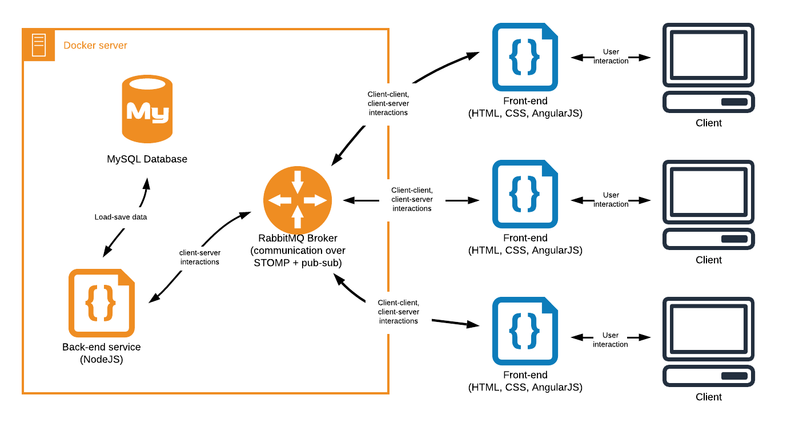

# CodyColor front-end service

[CodyColor Multiplayer](https://codycolor.codemooc.net/#!/) is an educational game developed by Digit S.r.l., inspired by the unplugged coding method **CodyColor**. Additional information about the game can be found in the [Digit blog](https://digit.srl/codycolor-multiplayer-learn-by-having-fun/). The software infrastructure on which the game is based is based on two main components:

* the **back-end**, composed by a [message broker and a NodeJS executable](https://github.com/digit-srl/CodyColorServer); all the back-end code is contained and handled in a Docker infrastructure;
* the **font-end**, composed by a web app developed on the AngularJS framework.



This repository includes all the files that form the front-end system of the game.


## Code organization

The front-end of the game is essentially a cross-platform, single-page web app, built following PWA specifications. The website becomes dynamic thanks to the JavaScript code, all contained inside the ```/js``` folder. The code is completely modular, and built over the AngularJS framework. 

Every section of the web app is handled by an AngularJS **controller** file. All controllers are positioned inside the ```/js/controllers``` folder. Ths various features expressed by the code are grouped using AngularJS **factories**. In the practice of this app, every factory actually represents a different **code module**. Every module is then used by different controllers and by other modules.